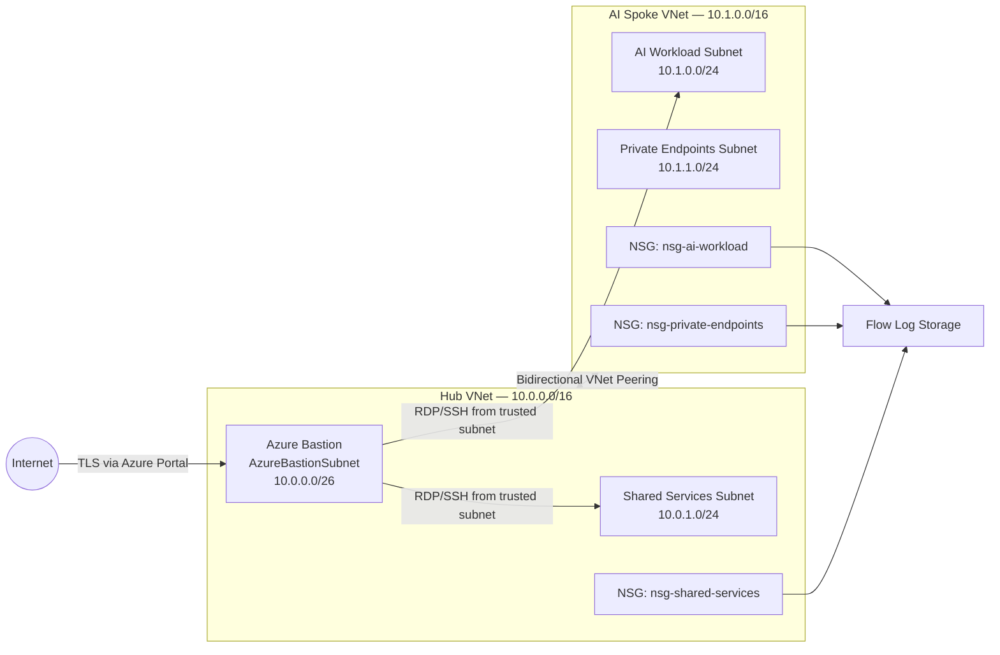

# Phase 2: Network Architecture & Isolation
### Hub-Spoke Network Foundation for a Private Azure AI Workload

**Contoso AI Labs | Microsoft Azure | Hub-Spoke | Private Networking | Zero Trust**

---

## Executive Summary

After establishing the identity perimeter in Phase 1, I designed and deployed the network foundation for the secure AI environment.

This phase implemented a hub-spoke topology, dedicated subnets, subnet-level Network Security Groups, Azure Bastion, NSG flow logging, and Azure Policy controls that restrict public IP creation. The network was designed so the AI workload could operate without direct public exposure while preserving administrative access, observability, and room for future expansion.

> **Outcome:** A segmented and observable Azure network was deployed with explicit trust boundaries, private administrative access, non-overlapping address spaces, and governance controls against accidental public exposure.

---

## Project Snapshot

| Category | Details |
|---|---|
| **Platform** | Microsoft Azure |
| **Primary focus** | Network segmentation, private access, traffic control, observability |
| **Architecture** | Hub-spoke VNet topology |
| **Key services** | Virtual Networks, VNet Peering, NSGs, Azure Bastion, Network Watcher, Azure Policy |
| **Security concepts** | Micro-segmentation, least privilege, private administration, defense in depth |
| **Threats addressed** | Public RDP/SSH exposure, lateral movement, misconfigured public IPs, unobserved network traffic |
| **Framework alignment** | Microsoft Cloud Adoption Framework, CIS Azure Foundations, NIST 800-207 |
| **Validation** | Peering state, NSG associations, flow-log configuration, policy assignment, Bastion deployment |

---

## Security Challenge

The AI workload needed a network that prevented direct internet exposure without sacrificing administrative access or future scalability.

A flat VNet would have made segmentation weaker and future expansion harder. Public IPs on compute resources would have introduced unnecessary RDP/SSH exposure. Broad NSG rules would have increased lateral-movement risk, while the absence of flow logging would have made it difficult to verify whether the network behaved as designed.

The design therefore had to provide:

- A clear boundary between shared services and workloads
- Non-overlapping address spaces
- Private administrative access
- Default-deny subnet controls
- Traffic visibility
- Governance against accidental public IP creation
- A path for future spokes and centralized services

---

## Architecture

---

## IP Addressing Plan

| Network | CIDR | Purpose |
|---|---|---|
| `vnet-hub` | `10.0.0.0/16` | Shared services and administrative access |
| `AzureBastionSubnet` | `10.0.0.0/26` | Azure Bastion |
| `snet-shared-services` | `10.0.1.0/24` | Future shared tooling |
| `vnet-spoke-ai` | `10.1.0.0/16` | AI workload boundary |
| `snet-ai-workload` | `10.1.0.0/24` | Compute and workload resources |
| `snet-private-endpoints` | `10.1.1.0/24` | Private endpoints for Azure AI, Key Vault, and related services |

---

## What I Implemented

### Hub-Spoke Topology

The hub VNet contains shared infrastructure, while the spoke VNet contains the AI workload. The peering relationship is explicit and non-transitive, allowing future spokes to be added without flattening the environment.

### Dedicated Subnets

Each subnet has a defined purpose:

- `AzureBastionSubnet` for managed administrative access
- `snet-shared-services` for centralized tooling
- `snet-ai-workload` for workload compute
- `snet-private-endpoints` for private service access

No general-purpose subnet was used.

### Network Security Groups

A dedicated NSG was assigned to each workload-related subnet.

| NSG | Subnet | Primary Rule |
|---|---|---|
| `nsg-ai-workload` | `snet-ai-workload` | Allow RDP/SSH only from Azure Bastion subnet |
| `nsg-private-endpoints` | `snet-private-endpoints` | Allow HTTPS from the trusted virtual network |
| `nsg-shared-services` | `snet-shared-services` | Allow RDP/SSH only from Azure Bastion subnet |

Default platform deny rules remained in place so access was granted only through explicit exceptions.

### Azure Bastion

Azure Bastion was deployed in the hub to provide browser-based RDP/SSH access without assigning public IPs to workload VMs.

Because Bastion bills continuously and cannot be paused, the project uses a deploy/delete operating model during active lab work.

### NSG Flow Logs

Flow logging was enabled for the three workload-facing NSGs and directed to a dedicated storage account.

Traffic Analytics was intentionally deferred until Phase 5, when the Log Analytics workspace and Sentinel environment are created.

### Azure Policy

A policy was assigned to deny public IP creation in the project resource group. The Bastion public IP was excluded by resource path so the same named resource could be recreated during later lab sessions without revising the policy assignment.

---

## Key Engineering Decisions and Tradeoffs

| Decision | Rationale | Tradeoff |
|---|---|---|
| Use hub-spoke instead of a flat VNet | Creates explicit workload and shared-service boundaries | Adds peering and routing complexity |
| Use one spoke | Matches the current single-workload scope | Does not demonstrate multi-spoke traffic flows yet |
| Use non-overlapping `/16` VNet ranges | Required for peering and future network growth | Consumes more address space than the lab immediately needs |
| Use dedicated `/24` workload subnets | Provides room for future resources and private endpoints | Larger than current resource count requires |
| Use Bastion instead of public RDP/SSH | Removes direct VM exposure to the internet | Adds continuous hourly cost |
| Use NSGs at each subnet | Limits lateral movement and supports micro-segmentation | Requires more rule management |
| Enable flow logs before Sentinel | Preserves visibility from the start of the network lifecycle | Traffic Analytics remains unavailable until Phase 5 |
| Omit Azure Firewall | Keeps the project within budget | No centralized egress filtering or threat-intelligence-based blocking |
| Deny public IP creation with a Bastion exclusion | Prevents accidental public exposure while preserving required Bastion architecture | Requires careful exclusion scoping |

---

## Implementation Issue and Resolution

During the first peering attempt, the spoke VNet was mistakenly created with the same `10.0.0.0/16` range as the hub.

Azure rejected the peering because the address spaces overlapped.

### Resolution

- Hub retained `10.0.0.0/16`
- Spoke was corrected to `10.1.0.0/16`
- All spoke subnets were resized inside the corrected range
- Peering was retried and completed successfully

> **Lesson:** CIDR planning is an architectural dependency, not a cosmetic configuration step. Overlapping ranges can block peering, hybrid connectivity, and future network integration.

---

## Results and Validation

| Result | Validation |
|---|---|
| Hub-spoke topology deployed | Both VNets were created with the intended subnets |
| Address-space conflict resolved | Spoke moved to `10.1.0.0/16` and peering succeeded |
| Bidirectional peering established | Both peering connections showed `Connected` |
| Subnet boundaries enforced | Three NSGs were associated with their intended subnets |
| Public VM administration avoided | Azure Bastion was deployed in the hub |
| Traffic visibility enabled | NSG flow logs were configured for all three workload-facing NSGs |
| Public IP sprawl prevented | Azure Policy denied public IP creation except for the Bastion exclusion |
| Future observability path established | Flow logs were staged for Traffic Analytics and Sentinel integration in Phase 5 |

---

## Evidence

| Control | What it proves | Screenshot |
|---|---|---|
| Hub VNet created | Hub was provisioned with Bastion and shared-services subnets |  |
| Spoke VNet created | AI spoke was provisioned with corrected `10.1.0.0/16` address space |  |
| VNet peering connected | Bidirectional hub-spoke peering reached Connected state |  |
| NSGs configured | All three NSGs were created and associated correctly |  |
| Flow logs enabled | Network traffic logging was enabled across all three NSGs |  |
| Bastion deployed | Administrative access was provided without public VM IPs |  |
| Public IP policy assigned | Public IP creation was denied with a scoped Bastion exclusion |  |

---

## Framework Mapping

| Framework | Application |
|---|---|
| **Microsoft Cloud Adoption Framework** | Hub-spoke topology, centralized shared services, scalable network boundaries |
| **CIS Microsoft Azure Foundations** | NSGs, public exposure reduction, network logging, private administration |
| **NIST 800-207 Zero Trust** | Explicit trust boundaries, least privilege, micro-segmentation, continuous visibility |

---

## Lessons Learned

### CIDR planning must happen before deployment

The overlapping VNet ranges caused a real deployment failure and reinforced why IP planning must account for peering, hybrid connectivity, and future growth before resources are created.

### Segmentation is more valuable than resource count

A single-spoke architecture is still meaningful because the boundary between shared services and the workload already exists. Future workloads can be added without redesigning the original spoke.

### Private administration still has a cost model

Azure Bastion improves security by eliminating public RDP/SSH exposure, but it introduces an always-on cost. Security architecture has to account for operational and financial constraints, not just technical controls.

### Logging should begin with the network

Flow logs were enabled before Sentinel existed so the environment would not have an avoidable visibility gap between network deployment and SIEM onboarding.

### Not every enterprise control belongs in a lab

Azure Firewall was considered but intentionally omitted because its fixed hourly cost did not fit the lab budget. The decision was documented rather than hidden.

---

## Repository Navigation

- **Detailed implementation:** [Phase 2 Runbook](../runbooks/02-network-architecture-runbook.md)
- **Previous phase:** [Phase 1 — Identity Fortress](./01-identity-fortress.md)
- **Next phase:** [Phase 3 — Azure AI Services Deployment](./03-openai-deployment.md)
- **Project overview:** [Secure AI Deployment on Azure](../README.md)

---

**Phase 2 complete — the AI workload now has a segmented, observable, and private network foundation.**

