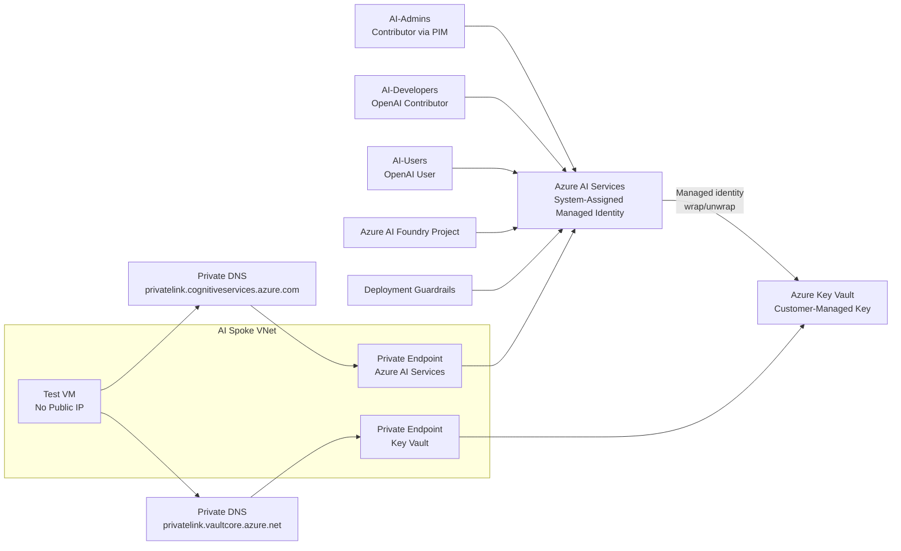

# Phase 3: Azure AI Services Deployment
### Private, Encrypted, and Governed Azure AI Workload

**Contoso AI Labs | Azure AI Services | Private Link | Customer-Managed Keys | Guardrails**

---

## Executive Summary

With identity and network isolation already established, I deployed the project's Azure AI workload into the private spoke environment.

This phase connected Azure AI Services to a private endpoint, enabled a system-assigned managed identity, configured customer-managed key encryption through Azure Key Vault, applied deployment-level AI guardrails, assigned least-privilege RBAC roles to the Phase 1 security groups, and validated private DNS resolution from a test VM with no public IP.

> **Outcome:** The AI workload was deployed with private network access, organizational control over encryption keys, least-privilege authorization, model guardrails, and verified private connectivity.

---

## Project Snapshot

| Category | Details |
|---|---|
| **Platform** | Microsoft Azure |
| **Workload** | Internal engineering assistant using Azure AI Services |
| **Primary focus** | Private AI deployment, encryption, authorization, and AI guardrails |
| **Key services** | Azure AI Services, Azure AI Foundry, Key Vault, Private Link, Private DNS, PIM, Azure RBAC |
| **Security concepts** | Managed identity, CMK, least privilege, just-in-time access, private endpoints, content safety |
| **Threats addressed** | Public exposure, leaked API keys, unauthorized administration, sensitive-data leakage, prompt injection, jailbreak attempts |
| **Framework alignment** | NIST 800-207, OWASP Top 10 for LLM Applications, Microsoft Cloud Adoption Framework, CIS Azure Foundations |
| **Validation** | CMK saved successfully, RBAC mappings confirmed, PIM settings verified, private DNS resolved to `10.1.1.x` |

---

## Business Context

The deployed model represents an internal engineering assistant for employee knowledge queries rather than a customer-facing application.

This scope was intentional. It gave the environment a realistic workload to secure without introducing a separate application layer. Users interact through Azure AI Foundry or direct API calls, while the project focuses on the infrastructure, identity, governance, and detection controls surrounding the model.

---

## Security Challenge

The AI resource needed to be deployed without undoing the protections created in Phases 1 and 2.

The design had to ensure that:

- The service was not reachable through a public network path
- Workload authentication did not depend on stored API credentials
- Encryption key ownership remained with the organization
- Administrators, developers, and users received different permissions
- Privileged administrative access remained time-bound
- Guardrails were applied before the model became operational
- Private DNS resolved correctly inside the VNet
- The architecture could still function within Azure AI Foundry's resource-model limitations

---

## Architecture

---

## What I Implemented

### Azure Key Vault

A dedicated Key Vault was deployed with:

- Public network access disabled as the steady-state posture
- Private endpoint connectivity
- Private DNS integration
- RBAC authorization model
- RSA 2048 customer-managed encryption key
- Key rotation policy planning
- Separate data-plane permissions for the administrator and the AI resource

### Azure AI Services

The AI resource was deployed with:

- Public network access disabled
- Private endpoint in `snet-private-endpoints`
- System-assigned managed identity
- Private DNS integration
- Customer-managed key encryption
- Model deployment through Azure AI Foundry
- Deployment-level guardrails

### Customer-Managed Key Encryption

CMK configuration required several distinct access layers:

1. Temporarily changing the Key Vault network posture for provisioning
2. Granting the administrator `Key Vault Crypto Officer`
3. Allowing the administrator's client IP for key selection
4. Creating the encryption key
5. Granting the AI resource's managed identity `Key Vault Crypto Service Encryption User`
6. Saving the CMK configuration
7. Returning the vault to a tighter network posture

This proved that Azure management-plane permissions and Key Vault data-plane permissions are separate and must be validated independently.

### AI Guardrails

The model deployment was configured with:

- Jailbreak protection
- Indirect prompt-injection protection
- Medium blocking for hate, sexual, violence, and self-harm content
- Protected material controls
- PII detection for sensitive-data leakage
- Profanity filtering
- Task drift disabled because agentic workflows were outside project scope

### Azure RBAC and PIM

| Group | Role | Scope | Assignment |
|---|---|---|---|
| **AI-Admins** | Contributor | `rg-secure-ai-prod` | Eligible through PIM |
| **AI-Developers** | Cognitive Services OpenAI Contributor | Azure AI Services resource | Active |
| **AI-Users** | Cognitive Services OpenAI User | Azure AI Services resource | Active |

The Contributor role required:

- MFA
- Approval
- Justification
- Ticket information
- Four-hour maximum activation
- Three-month eligibility expiration

### Private Connectivity Validation

A disposable Windows VM was deployed into `snet-ai-workload` with:

- No public IP
- No public inbound ports
- Subnet-level NSG inheritance
- Administrative access through Azure Bastion

From inside the VM, the AI endpoint resolved to a private `10.1.1.x` address in the private endpoint subnet.

---

## Key Engineering Decisions and Tradeoffs

| Decision | Rationale | Tradeoff |
|---|---|---|
| Use managed identity instead of API keys | Eliminates stored credentials for service-to-service authentication | Requires correct RBAC and identity lifecycle management |
| Use customer-managed keys | Gives the organization control over rotation and revocation | Adds Key Vault, IAM, and network complexity |
| Configure guardrails before model use | Prevents an unprotected deployment from becoming operational | May reduce model flexibility for some use cases |
| Use PIM for AI administrators | Reduces standing administrative privilege | Adds activation and approval overhead |
| Keep developer and user roles active | Their permissions are narrower and required for normal work | Standing access still requires periodic review |
| Use private endpoints | Removes direct public data-plane access | Requires DNS integration and internal testing |
| Use `gpt-5-mini` | Lower operating cost while retaining a modern model tier | Less capability than the full model |
| Isolate Foundry scaffolding | Preserves the secured workload architecture despite portal limitations | Introduces a separate disposable resource group and policy exemption |
| Temporarily open Key Vault for CMK setup | Required to complete provisioning through the portal | Requires careful rollback to the secure steady state |

---

## Implementation Issues and Resolutions

### Key Vault access did not work through resource-group ownership alone

**Issue:** Owner or Contributor access on the resource group did not provide access to Key Vault keys.

**Resolution:** Assigned `Key Vault Crypto Officer` to the administrator for data-plane key management.

### CMK save failed despite the portal suggesting access would be granted automatically

**Issue:** The AI resource's managed identity lacked wrap/unwrap permissions.

**Resolution:** Manually assigned `Key Vault Crypto Service Encryption User` to the managed identity.

### Foundry Project creation conflicted with the public-access policy

**Issue:** Foundry attempted to create a separate resource that violated the subscription-level deny-public-access policy.

**Resolution:** Created a dedicated scaffolding resource group and applied a narrowly scoped exemption rather than weakening the policy globally.

### Existing AI resource was not always selectable in the Foundry connection picker

**Issue:** The connection UI filtered for a different Azure resource kind.

**Resolution:** Used the available connection path or custom endpoint/key fallback while keeping the secured `ai-contoso-openai` resource as the actual workload.

### Original model became unavailable

**Issue:** `gpt-4o-mini` was retired during the project.

**Resolution:** Moved to `gpt-5-mini` and documented model lifecycle as an operational dependency.

---

## Results and Validation

| Result | Validation |
|---|---|
| Key Vault privately deployed | Public access disabled and private endpoint connected |
| AI service privately deployed | Public access disabled and private endpoint connected |
| Credentialless service authentication enabled | System-assigned managed identity active |
| CMK encryption enabled | Azure AI Services encryption blade saved successfully against the Key Vault key |
| Key access separated by responsibility | Administrator and managed identity received different Key Vault roles |
| Guardrails applied | Deployment showed jailbreak, prompt-injection, content-harm, protected-material, and PII controls |
| Least-privilege access implemented | Admin, developer, and user groups mapped to distinct Azure roles |
| Standing admin access reduced | Contributor configured as PIM eligible with activation controls |
| Private DNS validated | AI endpoint resolved to a `10.1.1.x` private address from inside the VNet |
| Public VM exposure avoided | Test VM had no public IP and no public inbound ports |

---

## Evidence

| Control | What it proves | Screenshot |
|---|---|---|
| Key Vault deployed | Private endpoint and disabled public access |  |
| Azure AI Services deployed | Private network posture and managed identity |  |
| CMK configured | Customer-managed key and layered Key Vault access |  |
| Foundry connected | Scoped policy exemption and connected workload resource |  |
| Guardrails configured | Deployment-level AI safety controls |  |
| RBAC assignments | Group-to-role mappings and assignment types |  |
| PIM controls | Four-hour activation, MFA, justification, ticket, and approval |  |
| Test VM deployed | Private workload compute with no public IP |  |
| Private DNS validated | AI endpoint resolved to `10.1.1.5` from inside the VNet |  |

---

## Framework Mapping

| Framework | Application |
|---|---|
| **NIST 800-207 Zero Trust** | Private access, least privilege, managed identity, and just-in-time administration |
| **OWASP Top 10 for LLM Applications** | Prompt-injection, jailbreak, protected-material, and sensitive-data controls |
| **Microsoft Cloud Adoption Framework** | Encryption, key management, identity, and private connectivity patterns |
| **CIS Microsoft Azure Foundations** | Key Vault protection, identity controls, restricted network access, and logging readiness |

---

## Lessons Learned

### CMK is an operating model, not just an encryption setting

Customer-managed keys provide real control over revocation and rotation, but they also introduce responsibilities around Key Vault access, identity permissions, network posture, recovery, and lifecycle management.

### Management-plane and data-plane access are different

Owning the Azure resource did not automatically grant permission to manage cryptographic keys. Cloud security work requires validating both control planes independently.

### AI guardrails should be part of deployment

Prompt-injection protection, content filtering, protected materials, and PII controls should be established before users interact with the model—not added only after a security event.

### Platform behavior must be verified

The portal indicated that some permissions would be assigned automatically, but the CMK save failed until the managed identity role was granted manually. Successful security engineering requires checking the effective state rather than trusting setup text.

### Model lifecycle is a security and availability dependency

Model retirement can force architectural and operational changes. Production AI owners need a process for tracking retirement dates, testing replacements, and updating detections and guardrails.

---

## Repository Navigation

- **Detailed implementation:** [Phase 3 Runbook](./runbooks/03-openai-deployment-runbook.md)
- **Previous phase:** [Phase 2 — Network Architecture & Isolation](./02-network-architecture.md)
- **Next phase:** [Phase 4 — Governance & Defender for Cloud](./04-governance-defender.md)
- **Project overview:** [Secure AI Deployment on Azure](../README.md)

---

**Phase 3 complete — the AI workload is private, encrypted, governed, and ready for continuous security monitoring.**

