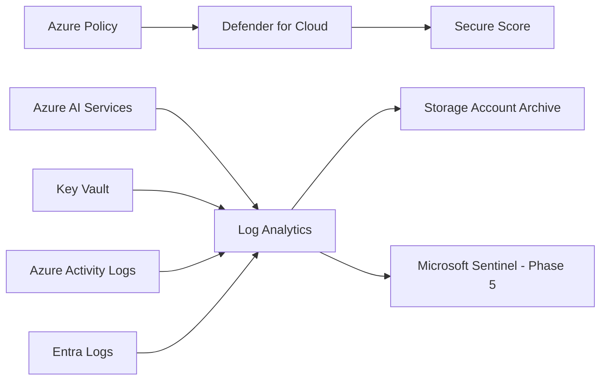

# Phase 4: Governance & Defender for Cloud

### Continuous Governance, Cloud Security Posture Management, and Workload Protection

**Contoso AI Labs | Azure Policy | Microsoft Defender for Cloud | Azure Monitor | Log Analytics**

---

# Executive Summary

With the AI platform deployed and secured through identity, networking, and private connectivity, this phase focused on operational governance and continuous security monitoring.

I validated Azure Policy compliance across the environment, enabled Microsoft Defender for Cloud workload protection, established a centralized Log Analytics Workspace, configured diagnostic settings, and began collecting platform telemetry in preparation for Microsoft Sentinel.

> **Outcome:** The environment transitioned from a securely deployed AI workload to a continuously monitored cloud platform capable of identifying configuration drift, improving security posture, and providing centralized visibility across Azure resources.

---

# Project Snapshot

| Category | Details |
|---|---|
| Platform | Microsoft Azure |
| Primary Focus | Governance, CSPM, Monitoring, Compliance |
| Key Services | Azure Policy, Defender for Cloud, Defender for AI Services, Log Analytics, Azure Monitor |
| Security Concepts | Secure Score, Continuous Monitoring, Least Privilege, Policy Compliance |
| Threats Addressed | Configuration drift, insecure deployments, AI workload exposure, missing diagnostics |
| Framework Alignment | Microsoft CAF, CIS Azure Foundations, NIST 800-53 |
| Validation | Policy compliance verified, Defender plans enabled, diagnostics centralized |

---

# Business Context

After deploying the AI workload, Contoso required a governance layer capable of continuously evaluating security posture. Static policy assignments alone were insufficient; operational visibility was needed to identify configuration drift, improve compliance, and monitor AI workloads throughout their lifecycle.

---

# Security Challenge

- Maintain policy compliance after deployment.
- Continuously assess AI workloads.
- Centralize operational telemetry.
- Separate governance from administration.
- Establish monitoring for future detection engineering.

---

# Architecture

---

# What I Implemented

## Azure Policy
- Verified compliance across deployed resources
- Reviewed non-compliant recommendations
- Documented planned remediations

## Microsoft Defender for Cloud
- Enabled Defender for AI Services
- Enabled Defender for Key Vault
- Enabled Defender for Servers
- Captured Secure Score baseline

## Monitoring
- Created Log Analytics Workspace
- Configured Azure Monitor Diagnostic Settings
- Enabled Azure Activity Logs
- Enabled Microsoft Entra diagnostic logs
- Archived diagnostics to Storage Account

## Governance
- Assigned Reader role for governance oversight

---

# Key Engineering Decisions & Tradeoffs

| Decision | Rationale | Tradeoff |
|---|---|---|
| Defender for AI | AI-specific threat visibility | Additional Defender cost |
| Log Analytics | Centralized investigations | Log storage costs |
| Storage archive | Long-term retention | Additional management |
| Reader RBAC | Least privilege | Read-only access |
| Policy + Defender | Prevention and detection | Operational complexity |

---

# Implementation Issues & Resolutions

- Policy compliance required revalidation after new infrastructure deployment.
- Diagnostic settings expanded to satisfy governance recommendations.
- Certain recommendations (such as disabling local authentication) were intentionally deferred until later security hardening to avoid interrupting Azure AI Foundry connectivity.

---

# Results & Validation

| Result | Validation |
|---|---|
| Policy compliance reviewed | Compliance dashboard |
| Defender enabled | AI, Key Vault, Servers protected |
| Secure Score baseline | Recommendations documented |
| Log Analytics operational | Telemetry centralized |
| Activity & Entra logs | Successfully collected |
| Reader role assigned | Governance separated from administration |

---

# Framework Mapping

| Framework | Application |
|---|---|
| Microsoft CAF | Governance |
| CIS Azure Foundations | Policy & Defender |
| NIST 800-53 | Continuous Monitoring |
| Zero Trust | Least Privilege |

---

# Lessons Learned

- Governance is an ongoing operational process.
- Azure Policy enforces configuration, while Defender continuously evaluates deployed workloads.
- Centralized logging significantly improves investigation and operational visibility.
- Least-privilege governance simplifies audits without increasing administrative risk.

---

# Repository Navigation

- Detailed implementation: `runbooks/04-governance-defender-runbook.md`
- Previous Phase: Phase 3 – Azure AI Services Deployment
- Next Phase: Phase 5 – Detection Engineering
