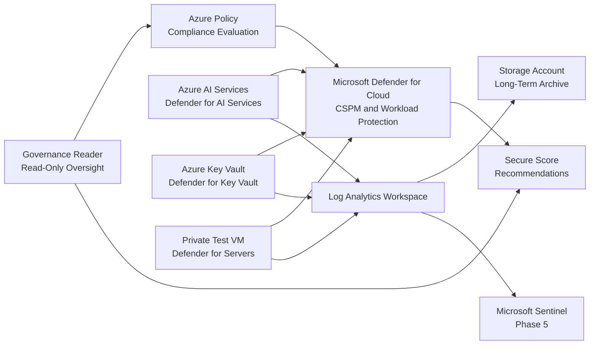

# Phase 4: Governance & Defender for Cloud
### Continuous Governance, Cloud Security Posture Management, and Workload Protection

**Contoso AI Labs | Azure Policy | Microsoft Defender for Cloud | Defender for AI Services | Log Analytics**

---

## Executive Summary

With the private Azure AI workload deployed, this phase extended the project's governance baseline and added continuous workload protection through Microsoft Defender for Cloud.

I reviewed Azure Policy compliance across the resources deployed in Phases 2 and 3, enabled Defender plans for Azure AI Services, Key Vault, and the private test VM, captured a Secure Score baseline, assigned read-only governance access, and configured centralized diagnostic logging in preparation for Phase 5 detection engineering.

> **Outcome:** The environment moved from secure deployment to continuous governance, posture assessment, workload protection, and centralized security telemetry.

---

## Project Snapshot

| Category | Details |
|---|---|
| **Platform** | Microsoft Azure |
| **Primary focus** | Governance, cloud security posture management, workload protection, and logging readiness |
| **Key services** | Azure Policy, Microsoft Defender for Cloud, Defender for AI Services, Defender for Key Vault, Defender for Servers, Log Analytics |
| **Security concepts** | Continuous compliance, Secure Score, defense in depth, least privilege, configuration-drift detection |
| **Threats addressed** | Misconfiguration, governance drift, exposed workloads, missing diagnostics, unauthorized administrative changes |
| **Framework alignment** | Microsoft Cloud Adoption Framework, CIS Microsoft Azure Foundations, NIST 800-53 |
| **Validation** | Policy state reviewed, Defender plans enabled, Secure Score captured, governance access separated, diagnostics configured |

---

## Business Context

Phases 1 through 3 established the identity, network, encryption, authorization, and AI workload controls required to operate the environment securely.

The next requirement was to ensure those controls remained effective after deployment. Contoso needed a governance and posture-management layer that could identify configuration drift, surface security recommendations, protect deployed workloads, and prepare the environment for centralized detection and response.

---

## Security Challenge

The environment needed to extend governance without duplicating controls from earlier phases.

The design had to ensure that:

- Existing Azure Policy assignments were evaluated against newly deployed resources
- AI Services, Key Vault, and compute resources received continuous security assessment
- Security posture could be measured through Secure Score
- Governance reviewers could inspect compliance without receiving modification rights
- Diagnostic telemetry could be centralized for Phase 5 detection engineering
- Recommendations that would disrupt the active workload were documented and deferred rather than applied blindly

---

## Architecture

---

## What I Implemented

### Azure Policy Compliance Review

The governance baseline established in earlier phases was reviewed against the completed network and AI resources.

This included:

- Reviewing policy assignments scoped to `rg-secure-ai-prod`
- Verifying compliance for public-network and managed-identity controls
- Investigating non-compliant recommendations
- Remediating findings that could be addressed safely
- Documenting controls that required a later authentication migration or operational phase

### Microsoft Defender for Cloud

Microsoft Defender for Cloud was enabled to provide continuous posture management and workload protection beyond static policy enforcement.

The following Defender plans were enabled:

- **Defender for AI Services**
- **Defender for Key Vault**
- **Defender for Servers**

This added security recommendations and workload-specific monitoring across the AI service, encryption platform, and private compute layer.

### Secure Score Baseline

A Secure Score baseline was captured to establish the environment's initial security-posture measurement.

Recommendations were reviewed according to:

- Security impact
- Implementation complexity
- Cost
- Dependency on future project phases
- Risk of disrupting the active Azure AI workload

### Centralized Diagnostic Logging

A Log Analytics Workspace was configured as the central destination for operational and security telemetry.

Diagnostic data was configured for:

- Azure AI Services
- Azure Key Vault
- Azure Activity Logs
- Microsoft Entra ID logs
- Supporting Azure resources where applicable

A Storage Account was retained as a second destination for longer-term archival.

### Governance Reader Access

A dedicated `Reader` role was assigned at the resource-group scope for governance and audit review.

This separated the ability to inspect:

- Azure Policy compliance
- Secure Score
- Defender recommendations
- Resource configuration

from the ability to modify the environment.

---

## Key Engineering Decisions and Tradeoffs

| Decision | Rationale | Tradeoff |
|---|---|---|
| Combine Azure Policy and Defender for Cloud | Policy evaluates configuration state while Defender continuously assesses posture and workload risk | Requires managing two complementary governance systems |
| Enable Defender for AI Services | Adds AI-workload-specific security monitoring and recommendations | Introduces additional Defender cost |
| Centralize logs in Log Analytics | Creates one location for queries, investigations, alerts, and Sentinel onboarding | Log ingestion and retention generate cost |
| Archive diagnostics to Storage | Supports longer retention outside the active analytics tier | Adds another destination to manage |
| Assign Reader for governance oversight | Preserves least privilege for auditors and reviewers | Reviewers cannot directly remediate findings |
| Defer disruptive recommendations | Prevents security remediation from breaking the active Foundry connection | Leaves documented technical debt until migration is complete |

---

## Implementation Issues and Resolutions

### Policy recommendations did not update immediately

**Issue:** A resource could remain listed as non-compliant after its diagnostic or security settings were changed.

**Resolution:** Verified the actual resource configuration and allowed time for Azure Policy reevaluation rather than repeatedly changing a correctly configured resource.

### Local-authentication remediation conflicted with the current Foundry connection

**Issue:** Disabling key-based authentication would have interrupted an Azure AI Foundry connection that still relied on an API key.

**Resolution:** Documented the recommendation for later migration to Microsoft Entra authentication and managed identity instead of enforcing it before the replacement authentication path was validated.

### Public-network policy interfered with Azure AI Foundry access

**Issue:** A custom network-restriction policy prevented Foundry access while the secured Azure AI resource used private networking.

**Resolution:** Removed or relaxed the development-time policy assignment and preserved the control as a future enforcement item after the final access model is validated.

### Governance and monitoring boundaries required clarification

**Issue:** Azure Policy, Defender for Cloud, Azure Monitor, and Log Analytics appeared to overlap.

**Resolution:** Separated their roles: Policy evaluates configuration, Defender assesses posture and workloads, Azure Monitor collects telemetry, and Log Analytics stores and queries that telemetry.

---

## Results and Validation

| Result | Validation |
|---|---|
| Existing governance baseline reviewed | Azure Policy compliance dashboard showed assigned policies and resource states |
| Workload-protection plans enabled | Defender for AI Services, Key Vault, and Servers displayed as enabled |
| Security posture measured | Secure Score baseline and recommendations were captured |
| Governance access separated | Reader role appeared at the `rg-secure-ai-prod` scope |
| AI diagnostics enabled | Audit, resource logs, and metrics were routed to configured destinations |
| Telemetry centralized | Log Analytics Workspace selected as the analytics destination |
| Long-term retention supported | Storage Account configured as an archival destination |
| Phase 5 prerequisites established | Core platform and identity telemetry were prepared for Sentinel onboarding |

---

## Evidence

| Control | What it proves | Screenshot |
|---|---|---|
| Policy compliance review | Earlier policy assignments were evaluated against the completed environment |  |
| Defender plans enabled | AI Services, Key Vault, and Servers workload-protection plans were activated |  |
| Secure Score baseline | Cloud security posture was measured and recommendations were available |  |
| Governance Reader role | Audit access was separated from administrative permissions | |
| Log Analytics Workspace | Centralized analytics destination was deployed and operational |  |
| AI diagnostic settings | Audit logs, resource logs, and metrics were enabled for Azure AI Services |  |
| Azure Activity Logs | Subscription control-plane events were routed to the workspace |  |
| Microsoft Entra logs | Identity audit and sign-in telemetry was routed to the workspace | `screenshots/phase-04/10-entra-diagnostic-settings.png` |

> Replace the screenshot paths above with your GitHub attachment URLs after uploading the images to the repository issue, pull request, or README editor.

---

## Framework Mapping

| Framework | Application |
|---|---|
| **Microsoft Cloud Adoption Framework** | Governance disciplines, security management, monitoring, and operational readiness |
| **CIS Microsoft Azure Foundations** | Defender enablement, logging, access control, and security-posture recommendations |
| **NIST 800-53** | Continuous monitoring, audit review, least privilege, and configuration management |
| **NIST 800-207 Zero Trust** | Continuous verification and separation of governance from administrative access |

---

## Lessons Learned

### Governance must be revalidated after resources are deployed

Assigning policy before deployment establishes intent, but the real test occurs when the completed environment is evaluated against those controls.

### Azure Policy and Defender for Cloud solve different problems

Policy evaluates whether resource configurations comply with defined requirements. Defender for Cloud adds continuous posture assessment, prioritized recommendations, and workload-protection capabilities.

### Compliance should not be pursued blindly

A recommendation can be valid while still being unsafe to enforce immediately. Disabling local authentication before validating Entra-based connectivity would have improved one control while breaking the workload.

### Centralized telemetry is a prerequisite for detection engineering

Diagnostic settings, Activity Logs, identity logs, and Log Analytics needed to be established before Sentinel analytics rules and KQL detections could produce reliable results.

### Least privilege also applies to oversight

Auditors and governance reviewers need visibility, not modification rights. A Reader assignment provides the required access without expanding the administrative attack surface.

---

## Related Documentation

- [Previous Phase 3 Portfolio Case Study](./03-openai-deployment.md)
- [Phase 4 Runbook](./runbooks/04-governance-defender-runbook.md)
- [Next Phase 5 — Detection Engineering](./05-detection-engineering.md)
- [Project Overview](../README.md)

---

**Phase 4 complete — the Azure AI platform is governed, continuously assessed, and ready for detection engineering.**

