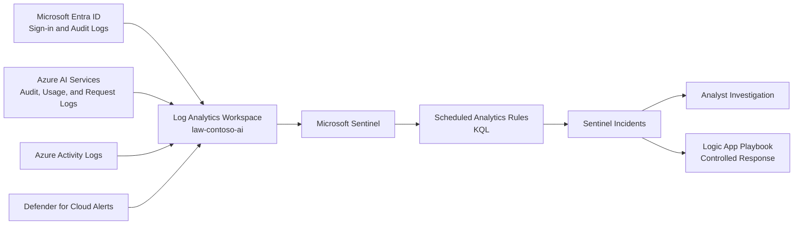

# Phase 5: Detection Engineering
### Microsoft Sentinel, KQL Analytics, and Automated Response

**Contoso AI Labs | Microsoft Sentinel | KQL | Logic Apps | Identity and AI Telemetry**

---

## Executive Summary

With governance, Defender for Cloud, and centralized telemetry established, this phase converted collected logs into actionable detections.

I enabled Microsoft Sentinel on the existing Log Analytics Workspace, verified identity and Azure AI telemetry, created analytics rules for high-risk identity and AI behaviors, added dedicated monitoring for the emergency-access account, and designed a narrowly scoped Logic App playbook for automated containment.

> **Outcome:** The platform gained a centralized SIEM layer capable of detecting suspicious identity activity, AI abuse patterns, and unauthorized access while preserving human review for lower-confidence events.

---

## Project Snapshot

| Category | Details |
|---|---|
| **Platform** | Microsoft Azure |
| **Primary focus** | Detection engineering, incident generation, and automated response |
| **Key services** | Microsoft Sentinel, Log Analytics, KQL, Logic Apps, Microsoft Entra ID |
| **Security concepts** | SIEM, correlation, analytics rules, entity mapping, automation, alert tuning |
| **Threats addressed** | Prompt injection, jailbreak behavior, anomalous token usage, off-hours access, impossible travel, emergency-account use |
| **Framework alignment** | NIST 800-61, MITRE ATT&CK, OWASP Top 10 for LLM Applications |
| **Validation** | Rules enabled, test incidents generated, entity mappings reviewed, automation scoped |

---

## Business Context

The environment already collected Azure Activity, Entra, Key Vault, and Azure AI telemetry. Logs alone, however, do not provide an operational defense unless they are transformed into detections that analysts can investigate.

Contoso needed a SIEM layer that could correlate identity and workload behavior, prioritize high-confidence events, and support repeatable response procedures.

---

## Security Challenge

The detection layer needed to:

- Use telemetry already collected in Phase 4
- Detect both identity and AI-specific threats
- Avoid creating rules that could never fire because the required fields were unavailable
- Map accounts, hosts, IP addresses, and Azure resources into Sentinel entities
- Balance alert sensitivity against false positives
- Restrict automated containment to high-confidence scenarios
- Produce testable incidents for Phase 8 adversarial validation

---

## Architecture

---

## What I Implemented

### Microsoft Sentinel Onboarding

Microsoft Sentinel was enabled on `law-contoso-ai`, preserving the centralized telemetry foundation created in Phase 4 rather than creating a second workspace.

### Data Validation

The workspace was checked for the tables and fields required by each detection, including:

- `SigninLogs`
- `AuditLogs`
- `AzureActivity`
- Azure AI or resource diagnostic tables
- Defender and security alert tables where available

### Custom Analytics Rules

The detection set included:

| Detection | Purpose | Default Severity |
|---|---|---|
| Prompt Injection Indicators | Detect known instruction-override and prompt-manipulation patterns | Medium |
| Jailbreak Indicators | Identify common attempts to bypass model safeguards | High |
| Anomalous Token Consumption | Identify sudden usage spikes or potential abuse | Medium |
| Off-Hours AI Access | Flag AI workload activity outside expected operating hours | Low/Medium |
| Impossible-Travel Correlation | Identify geographically inconsistent sign-ins near AI access | High |
| Break-Glass Account Sign-In | Alert on any use of the emergency account | High |

### Entity Mapping

Rules were configured to map available entities such as:

- Account
- IP address
- Host
- Azure resource
- Cloud application

### Automated Response

A Logic App playbook was designed for high-confidence incidents. The response flow included:

1. Receive the Sentinel incident
2. Validate the triggering analytics rule and account
3. Exclude emergency and service accounts
4. Notify the administrator
5. Contain the test identity only when the conditions are satisfied

### Conditional Access Insights

The Conditional Access Insights and Reporting workbook was revisited after the Log Analytics dependency was satisfied.

---

## Key Engineering Decisions and Tradeoffs

| Decision | Rationale | Tradeoff |
|---|---|---|
| Reuse `law-contoso-ai` | Preserves one central telemetry plane | Requires careful table and retention management |
| Use scheduled KQL rules | Supports custom AI and identity logic | Requires tuning and ongoing maintenance |
| Alert on every break-glass sign-in | Emergency-account use should be extremely rare | Legitimate emergency use still generates an incident |
| Automate only high-confidence response | Reduces containment delay without over-automating | Lower-confidence incidents remain manual |
| Validate schema before rule deployment | Prevents nonfunctional queries | Adds engineering time before activation |
| Map Sentinel entities | Improves investigation graphs and automation inputs | Depends on fields available in each log source |

---

## Implementation Issues and Resolutions

### Log schemas varied by diagnostic source

**Issue:** Azure AI logs and fields can differ by resource type and diagnostic configuration.

**Resolution:** Ran discovery queries first and adapted each rule to the tables and columns actually present in the workspace.

### A rule could be syntactically valid but operationally useless

**Issue:** Queries may run successfully while returning no meaningful events because the required logging category is not enabled.

**Resolution:** Validated data ingestion and generated controlled test activity before enabling production-style schedules.

### Automated account disablement created unnecessary risk

**Issue:** Automatically disabling a user based only on a broad text-pattern rule could create a false-positive outage.

**Resolution:** Scoped the playbook to a dedicated test identity and high-confidence conditions, with notification and exclusions.

---

## Results and Validation

| Result | Validation |
|---|---|
| Sentinel enabled | `law-contoso-ai` appeared as an active Sentinel workspace |
| Required tables identified | Discovery queries returned identity and Azure platform telemetry |
| Analytics rules active | Detection rules displayed as enabled |
| Entity mappings configured | Account, IP, and resource fields mapped where available |
| Break-glass monitoring established | Dedicated high-severity rule created |
| Controlled automation prepared | Logic App linked to the intended incident path |
| End-to-end incident generated | Controlled test activity produced a Sentinel incident |

---

## Evidence

| Control | What it proves | Screenshot |
|---|---|---|
| Sentinel enabled | The existing workspace was onboarded to Microsoft Sentinel |  |
| Data connectors and tables | Identity and workload telemetry reached the workspace |  |
| Conditional Access workbook | The Phase 1 reporting dependency was resolved |  |
| Analytics rules | Custom detections were deployed and active |  |
| Entity mappings | Incidents contain useful investigation entities | `screenshots/phase-05/05-entity-mappings.png` |
| Automation playbook | Controlled response workflow was attached | `screenshots/phase-05/06-automation-playbook.png` |
| Triggered incident | End-to-end detection generated an incident | `screenshots/phase-05/07-incident-triggered.png` |

---

## Framework Mapping

| Framework | Application |
|---|---|
| **NIST 800-61** | Detection, analysis, containment, and incident-handling readiness |
| **MITRE ATT&CK** | Technique mapping for identity, access, and suspicious execution behaviors |
| **OWASP Top 10 for LLM Applications** | Prompt-injection, model-abuse, and resource-consumption monitoring |
| **Microsoft Cloud Adoption Framework** | Centralized monitoring and security operations |

---

## Lessons Learned

### Detection engineering starts with data engineering

A detection cannot compensate for missing telemetry. Table discovery, diagnostic configuration, and field validation must occur before writing the final rule.

### A query is not finished when it runs

The rule must also have a usable schedule, threshold, entity mapping, incident grouping strategy, and response owner.

### Automation requires a higher confidence threshold

A false-positive alert is inconvenient; an automated false-positive containment action can interrupt legitimate operations.

### Break-glass accounts are ideal high-confidence detections

The expected usage frequency is close to zero, making any sign-in worthy of immediate review.

### Detection validation belongs in a separate adversarial phase

Phase 5 establishes and unit-tests the detection layer. Phase 8 later evaluates the controls through structured attack simulation and documents findings.

---

## Related Documentation

- [Phase 4 — Governance & Defender for Cloud](./04-governance-defender.md)
- [Phase 5 Runbook](./runbooks/05-detection-engineering-runbook.md)
- [Phase 6 — Business Continuity & Recovery](./06-business-continuity-recovery.md)
- [Project Overview](../README.md)

---

**Phase 5 complete — centralized telemetry now drives actionable detection, investigation, and controlled response.**

