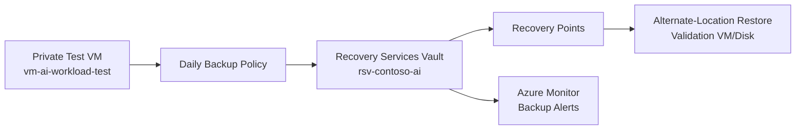

# Phase 6: Business Continuity & Recovery
### Azure Backup, Recovery Controls, and Restore Validation

**Contoso AI Labs | Recovery Services Vault | Azure Backup | Soft Delete | Restore Testing**

---

## Executive Summary

After establishing governance and detection capabilities, this phase addressed operational resilience by protecting the project's recoverable compute workload with Azure Backup.

I deployed a Recovery Services Vault, configured a cost-conscious backup policy, enabled backup for the private test VM, created an on-demand recovery point, reviewed vault security controls, and documented a restore-validation procedure.

> **Outcome:** The environment gained a documented and testable recovery capability for stateful compute, with retention, soft-delete protections, monitoring, and recovery evidence.

---

## Project Snapshot

| Category | Details |
|---|---|
| **Platform** | Microsoft Azure |
| **Primary focus** | Backup governance, recovery readiness, and restore validation |
| **Key services** | Azure Backup, Recovery Services Vault, Azure Monitor |
| **Protected workload** | `vm-ai-workload-test` and its managed disks |
| **Security concepts** | Recovery points, soft delete, immutability planning, least privilege, restore testing |
| **Threats addressed** | Accidental deletion, disk corruption, ransomware impact, operational failure |
| **Framework alignment** | NIST 800-34, NIST 800-53 CP family, Microsoft Cloud Adoption Framework |
| **Validation** | Vault deployed, backup succeeded, recovery point created, restore procedure validated |

---

## Business Context

Preventive and detective controls reduce risk, but they do not eliminate the possibility of failure. Contoso required a recovery process for stateful infrastructure so that accidental deletion, corruption, or destructive activity would not become a permanent outage.

The AI service itself is a managed platform service and is not protected by Azure VM Backup. Therefore, this phase focused on the recoverable compute workload and documented how configuration, code, and service settings are recovered through later Infrastructure as Code.

---

## Recovery Challenge

The design needed to:

- Protect the VM without implying that Azure Backup covers every PaaS resource
- Use retention appropriate for a portfolio lab
- Prevent easy deletion of recovery points
- Keep backup traffic and management aligned with the secured environment
- Validate restoration without overwriting the working production-style VM
- Document the distinction between backup, high availability, and disaster recovery
- Prepare recovery controls for later codification in Phase 9

---

## Architecture

---

## What I Implemented

### Recovery Services Vault

A dedicated vault was deployed in the project region with:

- Azure RBAC authorization
- Soft delete reviewed or enabled
- Enhanced security controls reviewed
- Backup monitoring enabled
- Resource locks considered after configuration

### Backup Policy

A daily policy was created with short, cost-conscious retention suitable for the lab. The policy documented:

- Backup schedule
- Daily recovery-point retention
- Time zone
- Instant restore snapshot retention
- Long-term retention intentionally omitted unless required

### VM Protection

Backup was enabled for `vm-ai-workload-test`, including its managed operating-system and selected data disks.

### On-Demand Backup

A manual backup was triggered to create an immediate recovery point and validate that the policy and vault configuration functioned correctly.

### Restore Validation

The recovery process was validated using an alternate-location or disk-level restore path to avoid overwriting the active VM.

### Recovery Documentation

The recovery plan documented:

- Recovery owner
- Recovery sequence
- Validation criteria
- Expected dependencies
- Items not covered by Azure VM Backup

---

## Key Engineering Decisions and Tradeoffs

| Decision | Rationale | Tradeoff |
|---|---|---|
| Protect the test VM first | It is the primary stateful IaaS workload | PaaS configuration requires separate recovery methods |
| Use short lab retention | Demonstrates policy design while controlling cost | Provides less historical depth than production retention |
| Validate through alternate restore | Avoids damaging the active environment | Creates temporary resources and cost |
| Keep vault in the workload region | Simplifies setup and VM backup support | Does not by itself provide cross-region disaster recovery |
| Document IaC as PaaS recovery path | Managed services are rebuilt from configuration rather than VM snapshots | Depends on Phase 9 completion |
| Review soft delete before locking | Prevents accidental recovery-point loss | Stronger immutability can complicate lab cleanup |

---

## Implementation Issues and Resolutions

### Azure Backup did not cover the full AI platform

**Issue:** Recovery Services Vault protects supported workloads such as VMs, not every managed Azure AI, policy, identity, or network configuration.

**Resolution:** Defined a hybrid recovery model: Azure Backup for stateful compute, source control for scripts and KQL, and Bicep in Phase 9 for infrastructure reconstruction.

### Backup success did not prove recoverability

**Issue:** A green backup job only proved that a recovery point was created.

**Resolution:** Added an alternate-location or disk restore test with explicit validation criteria.

### Security controls can complicate cleanup

**Issue:** Soft delete, immutability, and locks improve resilience but can prevent immediate deletion in a short-lived lab.

**Resolution:** Documented the desired production posture separately from temporary lab cleanup requirements.

---

## Results and Validation

| Result | Validation |
|---|---|
| Recovery Services Vault deployed | Vault available in the intended subscription and region |
| Backup policy configured | Daily schedule and retention visible |
| VM protected | Backup item displayed as healthy |
| Recovery point created | On-demand backup completed successfully |
| Restore process tested | Alternate disk or VM restore completed |
| Restored workload checked | Disk, boot state, or file availability validated |
| Monitoring available | Backup jobs and alerts visible |
| Recovery boundaries documented | PaaS and identity recovery responsibilities identified |

---

## Evidence

| Control | What it proves | Screenshot |
|---|---|---|
| Recovery Services Vault | Dedicated recovery boundary exists | `screenshots/phase-06/01-recovery-services-vault.png` |
| Backup policy | Schedule and retention were configured | `screenshots/phase-06/02-backup-policy.png` |
| Protected VM | The test VM is registered as a backup item | `screenshots/phase-06/03-vm-protected.png` |
| Successful backup job | A recovery point was generated | `screenshots/phase-06/04-backup-job-success.png` |
| Recovery point | Restore options are available | `screenshots/phase-06/05-recovery-point.png` |
| Restore validation | The alternate restore completed successfully | `screenshots/phase-06/06-restore-validation.png` |
| Vault security | Soft delete and security settings were reviewed | `screenshots/phase-06/07-vault-security-settings.png` |

---

## Framework Mapping

| Framework | Application |
|---|---|
| **NIST 800-34** | Contingency planning, recovery procedures, and validation |
| **NIST 800-53 CP family** | Backup, recovery, alternate processing, and contingency testing |
| **Microsoft Cloud Adoption Framework** | Reliability, operational readiness, and workload recovery |
| **CIS Azure Foundations** | Recovery-vault security and monitoring considerations |

---

## Lessons Learned

### Backup and disaster recovery are not interchangeable

A local recovery point supports restoration, but cross-region continuity requires additional replication, failover, and dependency planning.

### PaaS recovery is often configuration recovery

For managed AI services, policies, identities, and networking, version-controlled infrastructure and configuration are as important as traditional backup.

### Restore testing is the real control

A backup process is incomplete until the organization has proved that the data or workload can be restored and validated.

### Recovery design must include deletion protection

Soft delete, immutability, and privileged-operation controls protect the recovery layer from the same attacker or mistake that affected production.

---

## Related Documentation

- [Phase 5 — Detection Engineering](./05-detection-engineering.md)
- [Phase 6 Runbook](./runbooks/06-business-continuity-recovery-runbook.md)
- [Phase 7 — Multi-Tenant Administration](./07-multi-tenant-administration.md)
- [Project Overview](../README.md)

---

**Phase 6 complete — the stateful workload has documented backup, recovery-point protection, and restore validation.**

