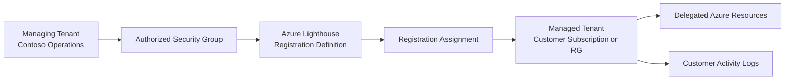

# Phase 7: Multi-Tenant Administration
### Secure Delegated Operations with Azure Lighthouse

**Contoso AI Labs | Azure Lighthouse | Delegated Resource Management | Cross-Tenant RBAC**

---

## Executive Summary

This phase extended the project from single-tenant deployment into a delegated administration model using Azure Lighthouse.

I designed a service-provider and customer-tenant scenario, created a least-privilege Azure Lighthouse registration definition and assignment, delegated a controlled subscription or resource-group scope, verified cross-tenant visibility, tested permitted and denied actions, and documented offboarding.

> **Outcome:** The platform demonstrated secure cross-tenant operations without creating guest administrator accounts or sharing permanent customer credentials.

---

## Project Snapshot

| Category | Details |
|---|---|
| **Platform** | Microsoft Azure |
| **Primary focus** | Cross-tenant administration and delegated operations |
| **Key services** | Azure Lighthouse, Azure RBAC, ARM/Bicep deployment |
| **Operating model** | Service provider managing a customer scope |
| **Security concepts** | Delegation, least privilege, separation of duties, centralized operations |
| **Threats addressed** | Shared credentials, excessive guest access, unmanaged cross-tenant administration |
| **Framework alignment** | Microsoft Cloud Adoption Framework, NIST 800-207, NIST 800-53 AC family |
| **Validation** | Delegation visible, authorized access successful, unauthorized actions denied, offboarding documented |

---

## Business Context

Enterprises, managed service providers, and centralized cloud teams frequently operate Azure resources across multiple tenants. Traditional approaches often rely on guest accounts, duplicated identities, or broad permanent access.

Contoso needed a model in which an operations team could manage a defined customer scope from its own tenant while the customer retained ownership and could remove the delegation.

---

## Security Challenge

The design needed to:

- Demonstrate multi-tenant operations without weakening tenant boundaries
- Avoid shared credentials and unnecessary guest accounts
- Delegate only the roles and scopes needed
- Preserve customer ownership
- Support centralized Azure Portal and management experiences
- Provide a clean offboarding process
- Remain practical in a lab where a second tenant or subscription may be limited

---

## Architecture

---

## What I Implemented

### Multi-Tenant Operating Model

The scenario defined:

- Managing tenant
- Managed customer tenant
- Delegated scope
- Authorized security group
- Required Azure roles
- Customer owner responsible for onboarding and offboarding

### Least-Privilege Delegation

The Lighthouse definition used narrowly scoped authorizations such as:

- Reader for visibility
- Monitoring Reader for operational review
- Security Reader where appropriate
- Contributor only if a controlled test required modification rights

Owner and User Access Administrator were not delegated by default.

### Registration Definition and Assignment

The Azure Lighthouse onboarding package included:

- Managed-by tenant ID
- Offer name and description
- Authorization entries
- Eligible authorizations only where supported and intentionally configured
- Registration assignment at the selected customer scope

### Cross-Tenant Validation

From the managing tenant, the authorized identity validated:

- Customer scope visibility
- Resource inventory access
- Monitoring and security visibility
- Permitted operations
- Denial of actions outside the delegated role

### Offboarding

The process for removing the registration assignment and verifying loss of delegated access was documented.

---

## Key Engineering Decisions and Tradeoffs

| Decision | Rationale | Tradeoff |
|---|---|---|
| Delegate a resource group where possible | Minimizes the managed blast radius | Provides less operational coverage than subscription scope |
| Authorize a group instead of a person | Supports lifecycle management and team operations | Requires group governance in the managing tenant |
| Start with Reader-style roles | Demonstrates safe visibility before change permissions | Limits remediation capabilities |
| Keep customer ownership | Preserves control and supports immediate offboarding | Customer participation is required for onboarding |
| Use template-based onboarding | Creates a reviewable, repeatable delegation artifact | Tenant IDs and principal IDs must be supplied accurately |
| Treat Lighthouse as operations, not identity synchronization | Maintains tenant separation | Some tenant-level tasks remain outside delegated scope |

---

## Implementation Issues and Resolutions

### A true second-tenant scenario may not be available

**Issue:** Azure Lighthouse is most meaningful across separate tenants, but a personal lab may have only one tenant or subscription.

**Resolution:** Designed the full cross-tenant package and used a second tenant/subscription when available. If unavailable, documented the limitation rather than claiming a production-equivalent validation.

### Broad roles undermined the purpose of delegation

**Issue:** Assigning Contributor everywhere would demonstrate access but not secure multi-tenant operations.

**Resolution:** Began with Reader, Monitoring Reader, and Security Reader, adding modification rights only for a narrowly defined test.

### Tenant-level services remained outside scope

**Issue:** Lighthouse delegates Azure Resource Manager scopes, not all Microsoft Entra tenant administration.

**Resolution:** Documented the boundary between Azure resource delegation and tenant-level identity administration.

---

## Results and Validation

| Result | Validation |
|---|---|
| Onboarding package created | Registration definition contained managing tenant and authorization data |
| Customer scope delegated | Registration assignment appeared at the intended scope |
| Cross-tenant visibility established | Managed resources appeared from the managing tenant |
| Least privilege validated | Reader-style actions succeeded |
| Excess privilege blocked | Unauthorized changes were denied |
| Customer ownership preserved | Managed tenant retained control of the assignment |
| Offboarding procedure verified | Delegation removal steps documented or tested |

---

## Evidence

| Control | What it proves | Screenshot |
|---|---|---|
| Managing-tenant group | Delegation targets a governed team principal | `screenshots/phase-07/01-managing-group.png` |
| Registration definition | Azure Lighthouse offer and authorizations were created | `screenshots/phase-07/02-registration-definition.png` |
| Registration assignment | Customer scope accepted the delegation | `screenshots/phase-07/03-registration-assignment.png` |
| My Customers view | Managed scope appears in the managing tenant | `screenshots/phase-07/04-my-customers.png` |
| Cross-tenant resources | Authorized resources are visible centrally | `screenshots/phase-07/05-cross-tenant-resources.png` |
| Least-privilege denial | An action outside the delegated role was blocked | `screenshots/phase-07/06-access-denied.png` |
| Offboarding | Registration assignment can be removed by the customer | `screenshots/phase-07/07-offboarding.png` |

---

## Framework Mapping

| Framework | Application |
|---|---|
| **NIST 800-207 Zero Trust** | Explicit authorization, least privilege, and tenant-boundary preservation |
| **NIST 800-53 AC family** | Account management, access enforcement, and separation of duties |
| **Microsoft Cloud Adoption Framework** | Centralized operations and multi-subscription/tenant management |
| **Microsoft Well-Architected Framework** | Operational excellence and governed administration |

---

## Lessons Learned

### Azure Lighthouse delegates resource management, not tenant ownership

The customer remains the resource owner and can remove the delegation. The managing tenant receives only the specified Azure RBAC permissions.

### Group-based authorization is more operationally sound

Delegating to a security group allows membership changes without redeploying the Lighthouse registration definition for every staffing change.

### Scope is as important as role

A modest role at subscription scope may still expose more than necessary. Resource-group scope can provide a safer portfolio demonstration.

### Multi-tenant administration has explicit boundaries

Microsoft Entra tenant administration, licensing, and some identity operations require separate mechanisms and should not be misrepresented as Lighthouse capabilities.

---

## Related Documentation

- [Phase 6 — Business Continuity & Recovery](./06-business-continuity-recovery.md)
- [Phase 7 Runbook](./runbooks/07-multi-tenant-administration-runbook.md)
- [Phase 8 — Red Team Validation](./08-red-team-validation.md)
- [Project Overview](../README.md)

---

**Phase 7 complete — Azure resources can be operated across tenant boundaries through controlled, customer-owned delegation.**

