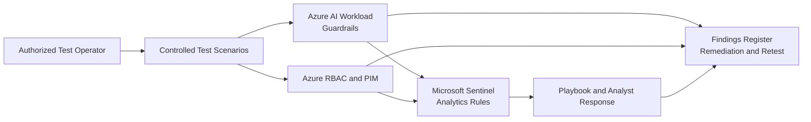

# Phase 8: Red Team Validation
### Authorized Attack Simulation and Control Findings

**Contoso AI Labs | OWASP LLM Testing | Microsoft Sentinel | RBAC | PIM | Findings Management**

---

## Executive Summary

This phase validated the project's preventive, detective, and response controls through authorized attack simulation inside the Contoso AI Labs environment.

I executed controlled prompt-manipulation tests, attempted sensitive-information extraction, tested unauthorized Azure actions, evaluated PIM and RBAC boundaries, triggered selected Sentinel detections, and documented results in a formal findings register.

> **Outcome:** Security controls were evaluated against realistic misuse scenarios, detection gaps were identified without overstating results, and remediation actions were documented for retesting.

---

## Project Snapshot

| Category | Details |
|---|---|
| **Platform** | Microsoft Azure |
| **Primary focus** | Security-control validation and findings management |
| **Key services** | Azure AI Foundry, Azure RBAC, PIM, Microsoft Sentinel, Defender for Cloud |
| **Test categories** | Prompt injection, jailbreak indicators, data disclosure, unauthorized access, privilege escalation |
| **Security concepts** | Adversary simulation, purple teaming, control validation, remediation, retesting |
| **Threats addressed** | AI guardrail bypass, sensitive-data disclosure, excessive privilege, failed detection, delayed response |
| **Framework alignment** | OWASP Top 10 for LLM Applications, MITRE ATT&CK, NIST 800-53 CA family |
| **Validation** | Tests authorized, expected outcomes defined, incidents reviewed, findings recorded |

---

## Business Context

Every security control in the previous phases represented a claim: private networking should block public access, RBAC should prevent unauthorized changes, guardrails should reduce unsafe model behavior, and Sentinel should identify selected suspicious activity.

Contoso needed evidence that those claims held under controlled, repeatable test conditions.

---

## Security Challenge

The validation process needed to:

- Remain limited to resources and identities owned by the project
- Distinguish preventive blocking from detective alerting
- Avoid claiming that a rule worked when the required telemetry was unavailable
- Use dedicated test identities
- Prevent automated response from affecting emergency or administrator accounts
- Record failed tests and false negatives honestly
- Produce remediation and retest evidence

---

## Architecture

---

## What I Validated

### Prompt Injection and Jailbreak Indicators

Benign, authorized prompts were used to test whether:

- Model guardrails blocked or constrained the request
- Relevant telemetry was generated
- Sentinel detection logic produced an alert when technically supported

### Sensitive-Information Disclosure

The test attempted to obtain system instructions or protected context without introducing real secrets into the environment.

### Unauthorized Resource Access

A user without sufficient Azure RBAC attempted to view or modify protected resources.

### Privilege Escalation Boundaries

A developer-level identity attempted administrator-level actions and tested whether PIM approval and activation controls remained enforced.

### Detection and Response

Selected scenarios were correlated with Sentinel incidents, entity mappings, automation runs, and analyst review.

---

## Key Engineering Decisions and Tradeoffs

| Decision | Rationale | Tradeoff |
|---|---|---|
| Use dedicated test identities | Limits operational risk and supports repeatability | Adds setup and cleanup |
| Define expected results before execution | Prevents post-test interpretation bias | Requires test-case preparation |
| Separate prevention from detection | A blocked action may not automatically generate an alert | More complex findings analysis |
| Avoid real secrets in disclosure tests | Prevents creating an actual data-loss event | Limits realism |
| Retest after remediation | Proves the fix changed the outcome | Extends the exercise |
| Record false negatives | Produces credible engineering evidence | Makes the report less cosmetically perfect |

---

## Findings Register

| ID | Test | Expected Control | Initial Result | Severity | Remediation | Retest |
|---|---|---|---|---|---|---|
| RT-01 | Prompt injection indicator | Guardrail and/or detection | *Pending execution* | TBD | TBD | TBD |
| RT-02 | Jailbreak indicator | Content safety and detection | *Pending execution* | TBD | TBD | TBD |
| RT-03 | Sensitive-information request | Refusal and logging | *Pending execution* | TBD | TBD | TBD |
| RT-04 | Unauthorized AI modification | Azure RBAC denial | *Pending execution* | TBD | TBD | TBD |
| RT-05 | Privileged action without PIM | RBAC/PIM denial | *Pending execution* | TBD | TBD | TBD |
| RT-06 | Selected detection trigger | Sentinel incident and response | *Pending execution* | TBD | TBD | TBD |

---

## Results and Validation

Because this phase is an execution and findings phase, final results should be entered only after the tests are run.

The completed evidence should demonstrate:

- Test authorization and scope
- Exact test case and expected result
- Preventive-control result
- Detection result
- Response result
- Finding severity
- Remediation owner
- Retest result

---

## Evidence

| Test | What it proves | Screenshot |
|---|---|---|
| Prompt-injection test | Guardrail and logging behavior | `screenshots/phase-08/01-prompt-injection-test.png` |
| Jailbreak-indicator test | Content safety and detection behavior | `screenshots/phase-08/02-jailbreak-test.png` |
| Disclosure test | Sensitive-information control behavior | `screenshots/phase-08/03-disclosure-test.png` |
| Unauthorized access | Azure RBAC boundary enforcement | `screenshots/phase-08/04-unauthorized-access.png` |
| PIM boundary | Privileged activation controls | `screenshots/phase-08/05-pim-boundary.png` |
| Sentinel incident | Detection and entity mapping | `screenshots/phase-08/06-sentinel-incident.png` |
| Playbook run | Automated response behavior | `screenshots/phase-08/07-playbook-run.png` |
| Retest | Remediation effectiveness | `screenshots/phase-08/08-retest.png` |

---

## Framework Mapping

| Framework | Application |
|---|---|
| **OWASP Top 10 for LLM Applications** | Prompt injection, sensitive-information disclosure, and model-abuse validation |
| **MITRE ATT&CK** | Identity, access, and privilege-related adversary behaviors |
| **NIST 800-53 CA family** | Security assessment, testing, findings, and remediation |
| **NIST 800-61** | Detection and response validation |

---

## Lessons Learned

### A prevented event and a detected event are different outcomes

A guardrail can block an action without producing the telemetry required by a Sentinel rule. Both results must be evaluated separately.

### Failed detections are valuable findings

A false negative can reveal a missing log category, incorrect table assumption, weak threshold, or unsupported data source.

### Test data must be safe by design

Security testing should not introduce real credentials, confidential data, or uncontrolled automated actions.

### Retesting closes the engineering loop

A remediation is not complete until the same test produces the expected improved result.

---

## Related Documentation

- [Phase 7 — Multi-Tenant Administration](./07-multi-tenant-administration.md)
- [Phase 8 Runbook](./runbooks/08-red-team-validation-runbook.md)
- [Phase 9 — Infrastructure as Code](./09-infrastructure-as-code.md)
- [Project Overview](../README.md)

---

**Phase 8 prepared — execute only within the authorized lab and replace pending findings with observed evidence.**

