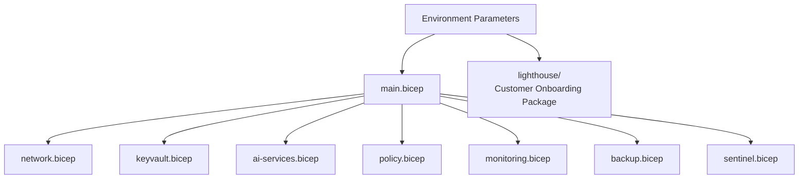

<div align="center">

# Phase 9: Infrastructure as Code
### Reproducible Azure AI Platform Deployment with Modular Bicep

**Contoso AI Labs | Bicep | Azure CLI | Modular Architecture | Deployment Validation**

</div>

---

## Executive Summary

The final phase converted the manually engineered environment into a modular Infrastructure as Code design.

I structured Bicep modules for network, Key Vault, Azure AI Services, policy, monitoring, backup, Lighthouse onboarding artifacts, and Sentinel components; centralized environment-specific values in parameter files; validated the templates; and defined a clean test-deployment process.

> **Outcome:** The platform became reviewable, repeatable, and version-controlled, while tenant-sensitive and operationally unsafe items remained deliberately manual.

---

## Project Snapshot

| Category | Details |
|---|---|
| **Platform** | Microsoft Azure |
| **Primary focus** | Reproducibility, configuration management, and deployment automation |
| **Key technologies** | Bicep, Azure CLI, ARM deployments, Git |
| **Modules** | Network, Key Vault, Azure AI, governance, monitoring, backup, Sentinel, Lighthouse package |
| **Security concepts** | Policy as code, RBAC as code, parameterization, secure secret handling, deployment validation |
| **Threats addressed** | Configuration drift, inconsistent deployment, undocumented permissions, manual error |
| **Framework alignment** | NIST 800-53 CM family, Microsoft Cloud Adoption Framework |
| **Validation** | Build and validation completed; clean-scope deployment process documented |

---

## Business Context

The earlier phases were built manually so that each Azure control could be understood and tested. Manual deployment, however, is not a scalable operating model.

Contoso needed version-controlled infrastructure definitions that could recreate the platform consistently, expose changes through code review, and support future environments without repeating portal steps.

---

## Engineering Challenge

The IaC design needed to:

- Preserve dependencies between network, identity, encryption, AI, monitoring, and recovery
- Separate reusable modules from environment parameters
- Avoid storing secrets or break-glass credentials in source control
- Account for tenant-level resources that Bicep cannot safely or fully manage
- Handle extension resources such as diagnostic settings and role assignments
- Include the new Phase 6 and Phase 7 designs without overstating automation
- Validate deployment in a clean scope

---

## Architecture



---

## What I Implemented

### Modular Repository Structure

```text
bicep/
├── main.bicep
├── modules/
│   ├── network.bicep
│   ├── keyvault.bicep
│   ├── ai-services.bicep
│   ├── policy.bicep
│   ├── monitoring.bicep
│   ├── backup.bicep
│   └── sentinel.bicep
├── parameters/
│   ├── dev.bicepparam
│   └── prod.example.bicepparam
└── README.md

lighthouse/
├── main.bicep
├── customer-onboarding.bicepparam
└── README.md
```

### Core Platform Modules

The modules represented:

- Hub-and-spoke networking
- NSGs and private DNS
- Key Vault and private endpoint
- Azure AI Services, identity, and private endpoint
- Policy assignments
- Log Analytics and diagnostic settings
- Recovery Services Vault and backup policy
- Sentinel onboarding and analytics-rule resources where supported

### RBAC and Deterministic Names

Role assignments used deterministic GUID generation to avoid duplicate assignments across deployments.

### Parameterization

Environment-specific values were separated from module logic, including:

- Region
- Naming prefix
- Address spaces
- Principal object IDs
- Policy effects
- Retention values
- Model and SKU selections

### Validation and Deployment

The code was designed for:

- `az bicep build`
- `az deployment group validate`
- What-if analysis
- Deployment into a clean test resource group or subscription scope
- Post-deployment validation

### Deliberately Manual Controls

The project documented items intentionally excluded from ordinary source-controlled automation:

- Break-glass passwords
- Secret values
- Final PIM approval workflow decisions
- Customer-side Lighthouse acceptance
- Certain tenant-level Entra configurations
- Destructive cleanup of protected backup data

---

## Key Engineering Decisions and Tradeoffs

| Decision | Rationale | Tradeoff |
|---|---|---|
| Use modular Bicep | Supports reuse, review, and isolated change | Requires dependency and output management |
| Separate Lighthouse package | Customer onboarding occurs in a different tenant/scope | Adds a second deployment workflow |
| Keep secrets out of parameters | Prevents source-control exposure | Requires secure runtime inputs or Key Vault |
| Use what-if before deployment | Identifies destructive changes | Adds another deployment step |
| Parameterize policy effects | Allows Audit in development and Deny in mature environments | Incorrect parameter choice can weaken enforcement |
| Treat some tenant controls as manual | Avoids unsafe or unsupported automation | Full deployment is not entirely one command |

---

## Implementation Issues and Resolutions

### Not every portal control maps cleanly to Bicep

**Issue:** PIM, certain Entra resources, Foundry behavior, and service-specific settings may require separate APIs or manual steps.

**Resolution:** Created an explicit manual-prerequisites section rather than pretending the deployment was completely automated.

### Resource IDs and role assignments were error-prone

**Issue:** Hard-coded IDs and nondeterministic role-assignment names can create failed redeployments.

**Resolution:** Used existing-resource references, built-in role IDs, module outputs, and deterministic GUIDs.

### Diagnostic settings depended on target resources

**Issue:** Monitoring extension resources cannot deploy before their parent resources exist.

**Resolution:** Used module dependencies and outputs so diagnostic settings were deployed after the target resource and workspace.

### Backup and Lighthouse required different operational scopes

**Issue:** Backup is typically workload/subscription scoped, while Lighthouse onboarding is customer deployed and cross-tenant.

**Resolution:** Kept backup in the platform deployment and Lighthouse as a separate customer onboarding package.

---

## Results and Validation

| Result | Validation |
|---|---|
| Modular code structure created | Modules and parameter files organized in source control |
| Bicep syntax validated | `az bicep build` completed |
| Deployment validated | Azure deployment validation completed |
| Change impact reviewed | What-if output reviewed before deployment |
| Clean-scope deployment planned/tested | Separate test scope used where practical |
| RBAC encoded | Role assignments represented with deterministic names |
| Monitoring and recovery represented | Workspace, diagnostics, vault, and policy modules included |
| Manual boundaries documented | Secrets, tenant tasks, and customer acceptance excluded appropriately |

---

## Evidence

| Control | What it proves | Screenshot |
|---|---|---|
| Repository structure | Modules and parameters are organized | `screenshots/phase-09/01-repository-structure.png` |
| Bicep build | Templates compile successfully | `screenshots/phase-09/02-bicep-build.png` |
| Validation | Azure accepted the deployment structure | `screenshots/phase-09/03-deployment-validation.png` |
| What-if | Planned resource changes were reviewed | `screenshots/phase-09/04-what-if.png` |
| Deployment | Clean-scope deployment completed | `screenshots/phase-09/05-deployment-success.png` |
| Resource graph | Expected resources were created | `screenshots/phase-09/06-deployed-resources.png` |
| RBAC as code | Role assignments were deployed reproducibly | `screenshots/phase-09/07-rbac-deployment.png` |
| Documentation | Manual prerequisites and limitations were recorded | `screenshots/phase-09/08-bicep-readme.png` |

---

## Framework Mapping

| Framework | Application |
|---|---|
| **NIST 800-53 CM family** | Baseline configuration, change control, and versioned infrastructure |
| **Microsoft Cloud Adoption Framework** | IaC, deployment automation, and platform engineering |
| **Microsoft Well-Architected Framework** | Operational excellence, repeatability, and reliability |
| **Zero Trust** | Consistent policy, identity, and network controls across redeployments |

---

## Lessons Learned

### Infrastructure as Code does not eliminate design decisions

Bicep makes decisions repeatable; it does not make poor architecture secure.

### Manual-first learning improved the final templates

Building the environment interactively exposed service dependencies and portal limitations before they were encoded.

### The best IaC documents its exceptions

A credible deployment identifies what remains manual, why it remains manual, and how that work is controlled.

### Validation must include idempotency and change review

A successful first deployment is not enough. Redeployment behavior and what-if output matter for safe operations.

---

## Related Documentation

- [Phase 8 — Red Team Validation](./08-red-team-validation.md)
- [Phase 9 Runbook](./runbooks/09-infrastructure-as-code-runbook.md)
- [Project Overview](../README.md)

---

<div align="center">

**Phase 9 complete — the Azure AI platform is documented as modular, reviewable, and reproducible infrastructure.**

</div>
